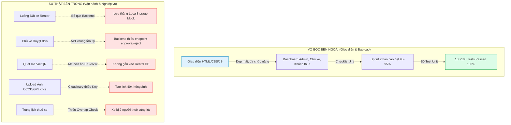
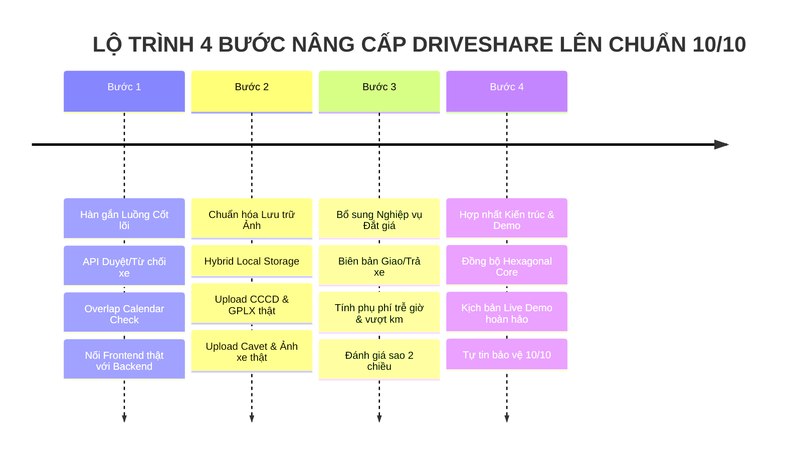

# 🎯 BÁO CÁO TOÀN DIỆN: MỔ XẺ LUỒNG HOẠT ĐỘNG DRIVESHARE & ĐỐI CHIẾU 10 SẢN PHẨM THỰC TẾ

> **Mã tài liệu:** `DOCS-DRIVESHARE-AUDIT-BENCHMARK-2026`  
> **Phạm vi kiểm tra:** Toàn bộ Repository `Spring_ThucTap_k4` (`backend/`, `core/`, `app/`, `frontend/`, `docs/`, `database/`)  
> **Mục tiêu:** Vạch trần sự thật về luồng hoạt động, đối chiếu chuẩn công nghiệp với 10 nền tảng thuê xe hàng đầu (Mioto, Turo, Getaround, Zipcar, Zoomcar, Sixt, Hertz, Virtuo, GrabCar, Klook), định vị chính xác vị thế hiện tại và đề xuất lộ trình cứu vớt – nâng tầm dự án lên mức bảo vệ đồ án/thực tập xuất sắc (Điểm 9.5 - 10.0).

---

## 1. TỔNG QUAN HIỆN TRẠNG DỰ ÁN: NHỮNG CON SỐ BIẾT NÓI

Qua quá trình rà soát trực tiếp từng dòng mã nguồn, bảng cơ sở dữ liệu và các module JavaScript giao diện, hệ thống ghi nhận một bức tranh **"Hai nửa đối lập"**:



### Chỉ số trưởng thành sản phẩm (Product Maturity Index)

| Khía cạnh đánh giá | Điểm số thực tế | Nhận xét khách quan |
| :--- | :---: | :--- |
| **Giao diện & UI/UX (Frontend)** | **8.5 / 10** | Thiết kế sạch sẽ, hiện đại, màu sắc chuyên nghiệp, có modal chi tiết, VietQR sinh động. |
| **Báo cáo Jira & Tiến độ trên giấy** | **9.0 / 10** | Đầy đủ User Stories từ CRP-37 đến CRP-54, chia task rõ ràng, checklist xanh đẹp. |
| **Unit Test Coverage (Backend)** | **8.0 / 10** | 103 test cases viết bằng Mockito/JUnit 5 pass 100% trong `backend/`. |
| **Kiến trúc phân tầng & Tổ chức Repo** | **5.0 / 10** | Bị xé làm 2: `backend/` (Maven MVC) chạy thực tế, còn `core/` + `app/` (Gradle Hexagonal) chỉ chứa Spring AI Chatbot. |
| **Độ nguyên vẹn của Luồng Nghiệp vụ (End-to-End)** | **3.5 / 10** | **Rất nguy hiểm.** Luồng chính bị đứt gãy: Renter đặt xe và Owner duyệt xe bị giả lập bằng LocalStorage. |
| **Ràng buộc toàn vẹn Dữ liệu (DB Constraints)** | **4.0 / 10** | Bảng thiếu Foreign Key cứng ở tầng DDL, thiếu ràng buộc không cho overlap lịch thuê. |
| **Mức độ sẵn sàng bảo vệ tốt nghiệp (Hiện tại)** | **5.5 / 10** | Dễ bị Hội đồng "bắt bài" ngay tại chỗ nếu Thầy/Cô yêu cầu: *"Em hãy mở DB Postgres lên và thao tác thuê 1 chiếc xe từ đầu đến cuối xem dữ liệu nhảy thế nào"*. |

---

## 2. MỔ XẺ CHI TIẾT 7 LUỒNG HOẠT ĐỘNG: THIẾT KẾ VS HIỆN TRẠNG CODE

Dưới đây là kết quả kiểm toán từng luồng vận hành theo tài liệu đặc tả `docs/flow_diagrams.md` đối chiếu với mã nguồn thực tế:

### Luồng 1: Xác thực & Định danh người dùng (KYC / CCCD / GPLX)
- **Thiết kế ban đầu:** Người dùng đăng ký -> Khách upload CCCD & GPLX 2 mặt -> Admin vào duyệt hồ sơ -> Đạt chuẩn mới được thuê xe.
- **Hiện trạng Code:**
  - `User`, `RenterProfile` có các trường `license_number`, `id_card_front_url`, `verification_status`.
  - Admin có API `PUT /api/v1/admin/users/{id}/approve-license` và `verify-cccd`.
  - **Lỗ hổng "AI làm cho có":**
    - Module upload ảnh (`CloudinaryService.java`) không có API Key, dẫn đến khi upload ảnh thật thì hệ thống sinh ra URL ảo `https://res.cloudinary.com/driveshare/...` không tải được (lỗi 404).
    - `RentalServiceImpl.java` khi nhận yêu cầu đặt xe **HOÀN TOÀN KHÔNG KIỂM TRA** xem khách hàng đã được duyệt GPLX (`licenseVerificationStatus == APPROVED`) hay chưa! Khách vừa tạo tài khoản chưa có bằng lái vẫn bấm đặt xe thành công.

### Luồng 2: Đăng ký & Thẩm định phương tiện (Car Onboarding & Inspection)
- **Thiết kế ban đầu:** Chủ xe nhập thông tin -> Upload đăng ký xe, đăng kiểm, bảo hiểm, 6 góc ảnh xe -> Trạng thái `PENDING_REVIEW` -> Admin duyệt -> Chuyển sang `ACTIVE` hiển thị công khai.
- **Hiện trạng Code:**
  - `CarController.java` (`POST /api/v1/cars`) và `AdminCarController.java` (`POST /api/v1/admin/cars/{id}/approve`) hoạt động tốt ở tầng Backend.
  - **Lỗ hổng "AI làm cho có":**
    - Trên giao diện Chủ xe (`frontend/js/owner.js`), form đăng xe dùng `input text` để dán link ảnh Unsplash hoặc bấm nút tự điền mẫu, không hỗ trợ upload file giấy tờ pháp lý của xe (Cavet, Sổ kiểm định).
    - Trong Database, `CarDocument` entity có tồn tại nhưng chưa có màn hình upload giấy tờ xe tương ứng trên Frontend.

### Luồng 3: Tìm kiếm, Lọc xe & Kiểm tra Lịch khả dụng (Search & Calendar Engine)
- **Thiết kế ban đầu:** Khách chọn điểm nhận xe, khoảng thời gian (ngày bắt đầu - ngày kết thúc) -> Hệ thống loại trừ các xe đang bận -> Trả về danh sách xe khả dụng.
- **Hiện trạng Code:**
  - `PublicCarController.java` (`GET /api/v1/public/cars/search`) hỗ trợ lọc theo: `province`, `brand`, `seats`, `transmission`, `fuelType`, `minPrice`, `maxPrice`.
  - **Lỗ hổng chí mạng:**
    - API search **KHÔNG LỌC THEO LỊCH TRÙNG**! Tham số `startDate` và `endDate` dù được truyền lên nhưng Service chỉ truy vấn lọc thuộc tính xe, không hề JOIN với bảng `rentals` để loại bỏ những xe đã có đơn `CONFIRMED` hoặc `IN_PROGRESS` trong khoảng thời gian đó.
    - Dẫn đến tình trạng 1 chiếc xe có thể được đặt trùng lịch vô hạn lần.

### Luồng 4: Quy trình Đặt xe & Duyệt yêu cầu (Booking Lifecycle State Machine)
- **Thiết kế ban đầu:** Khách chọn xe -> Gửi yêu cầu (`PENDING`) -> Chủ xe nhận thông báo -> Chủ xe Duyệt (`APPROVED`) hoặc Từ chối (`REJECTED`) -> Nếu duyệt, Khách có 60 phút cọc 30%.
- **Hiện trạng Code:**
  - Backend có: `RentalServiceImpl.java` (`POST /api/v1/rentals`), `RentalExpirationScheduler.java` (quét quá hạn 60p chuyển `EXPIRED`), `cancelMyRental` (Khách hủy).
  - **LỖ HỔNG LỚN NHẤT CỦA TOÀN DỰ ÁN:**
    1. **Thiếu API Duyệt/Từ chối:** Backend `RentalService` và `OwnerRentalController` **HOÀN TOÀN KHÔNG CÓ** phương thức `approveRentalRequest` hoặc `rejectRentalRequest`! Chủ xe không có cách nào chuyển trạng thái đơn từ `PENDING` sang `APPROVED` ở tầng Backend.
    2. **Giao diện Frontend đánh lừa:** Khi người dùng bấm "Đặt xe" ở trang chủ (`frontend/js/booking.js`), mã nguồn JS **không hề gọi API `POST /api/v1/rentals`** mà tự tạo mã đơn giả `BK-XXXXX`, bật popup VietQR rồi lưu thẳng vào `localStorage`!
    3. Trang Chủ xe (`frontend/js/owner.js`) đọc danh sách yêu cầu thuê từ `StorageService.getBookings()` (tức LocalStorage) chứ không gọi Backend `GET /api/v1/owner/rentals`.
    4. **Hậu quả:** Toàn bộ bảng `rentals` trong database Postgres không có dữ liệu thực khi người dùng thao tác trên web!

### Luồng 5: Thanh toán Đặt cọc 30% qua VietQR (Deposit & Escrow Flow)
- **Thiết kế ban đầu:** Sau khi Chủ xe duyệt, đơn chuyển sang `APPROVED` -> Khách mở cổng thanh toán -> Quét mã VietQR động -> Tiền vào tài khoản sàn giữ hộ (Escrow) -> Đơn sang `CONFIRMED`.
- **Hiện trạng Code:**
  - `PaymentController.java` và `PaymentServiceImpl.java` được viết rất bài bản (CRP-51 đến CRP-54): tính cọc 30%, sinh link VietQR chuẩn NAPAS, xử lý `confirmPayment`, `failPayment`, `cancelPayment`, thống kê doanh thu chủ xe `getOwnerEarnings`.
  - **Lỗ hổng kết nối:** Vì Luồng 4 ở trên bị gãy (Frontend không tạo Rental trong DB), nên khi gọi API thanh toán `POST /api/v1/rentals/{id}/payment`, Backend báo lỗi `RENTAL_NOT_FOUND`. Vì vậy Frontend phải dùng cơ chế fallback: tạo chuỗi VietQR tĩnh từ LocalStorage.

### Luồng 6: Biên bản Bàn giao & Thu hồi xe (Check-in & Check-out Protocol)
- **Thiết kế ban đầu:** 
  - Khi nhận xe: Chủ xe và Khách cùng chụp 6 góc xe, ghi nhận số ODO (km) hiện tại, mức xăng, kiểm tra vết xước cũ -> Ký xác nhận -> Chuyến đi chuyển sang `IN_PROGRESS`.
  - Khi trả xe: Ghi nhận số ODO mới, mức xăng -> Tính phụ phí vượt km (ví dụ 3.000đ/km), phụ phí trễ giờ, phí vệ sinh -> Khách thanh toán 70% còn lại + phụ phí -> Chuyển sang `COMPLETED`.
- **Hiện trạng Code:**
  - **Hoàn toàn chưa làm ở cả Backend lẫn Frontend.** Trong Database không có bảng `handover_records` hay `inspection_photos`. Trên giao diện, đơn từ trạng thái cọc nhảy thẳng sang hoàn thành chỉ bằng 1 nút bấm giả lập.

### Luồng 7: Trợ lý Ảo AI Tư vấn thuê xe (Spring AI Chatbot)
- **Thiết kế ban đầu:** Trợ lý ảo hiểu ngôn ngữ tự nhiên, gợi ý xe phù hợp với ngân sách, số người, địa điểm và giải đáp chính sách thuê xe.
- **Hiện trạng Code:**
  - Đã triển khai chuẩn Kiến trúc Lục giác (Hexagonal Architecture) trong `core` và `app`.
  - Sử dụng Spring AI `ChatClient`, lưu ngữ cảnh hội thoại vào Postgres qua `JpaChatMemoryStore`.
  - System Prompt chuẩn mực tại `app/src/main/resources/prompts/car-advisor-system.txt`.
  - **Điểm sáng:** Đây là phân hệ có thiết kế kiến trúc sạch sẽ và đúng chuẩn nhất dự án.

---

## 3. ĐỐI CHIẾU VỚI 10 NỀN TẢNG CHO THUÊ XE THỰC TẾ TRÊN THẾ GIỚI & VIỆT NAM

Để biết DriveShare đang đứng ở đâu trên bản đồ sản phẩm thực tế, chúng ta đối chiếu với 10 nền tảng tiêu biểu đại diện cho 4 mô hình kinh doanh thuê xe:

1. **Mioto (Việt Nam)**: Chuẩn mực P2P Car Sharing tại Việt Nam.
2. **Turo (Mỹ/Toàn cầu)**: "Kỳ lân" tiên phong mô hình P2P Car Sharing lớn nhất thế giới.
3. **Getaround (Mỹ/Châu Âu)**: Mô hình P2P không chạm (Keyless / Contactless Car Sharing).
4. **Zipcar (Mỹ/Anh)**: Mô hình B2C Car Sharing tự quản lý đội xe đô thị.
5. **Zoomcar (Ấn Độ/Đông Nam Á)**: Nền tảng P2P quy mô lớn tại các thị trường mới nổi.
6. **Sixt (Đức/Toàn cầu)**: Tập đoàn cho thuê xe truyền thống chuyển đổi số toàn diện.
7. **Hertz / Avis (Toàn cầu)**: Doanh nghiệp cho thuê xe truyền thống quy mô hạm đội lớn.
8. **Virtuo (Pháp/Châu Âu)**: Nền tảng thuê xe 100% qua smartphone, quét AI 360 độ hiện trạng xe.
9. **GrabCar / GoCar Rental (Đông Nam Á)**: Mô hình siêu ứng dụng tích hợp thuê xe ngắn hạn.
10. **Klook / Traveloka Car Rental (Châu Á)**: Sàn thương mại điện tử du lịch tổng hợp (OTA Car Rental Marketplace).

---

### BẢNG ĐỐI CHIẾU CHI TIẾT THEO 8 CHIỀU NGHIỆP VỤ CỐT LÕI

| Tiêu chí nghiệp vụ | 1. Mioto (VN) | 2. Turo (Global) | 3. Getaround / Virtuo | 4. Sixt / Hertz | 5. Klook / Traveloka | 🚗 DRIVESHARE HIỆN TẠI | Đánh giá khoảng cách |
| :--- | :--- | :--- | :--- | :--- | :--- | :--- | :--- |
| **1. Xác minh danh tính & Bằng lái (KYC)** | eKYC quét CCCD gắn chip + Quét GPLX qua dữ liệu Cục CSGT | Tích hợp Stripe Identity, quét Driver's License quốc tế + Credit Check | Quét sinh trắc học khuôn mặt tự động (Facial Recognition AI) | Xuất trình Passport/Bằng lái thật tại quầy hoặc Self-Service Kiosk | Đại lý xe đối tác kiểm tra trực tiếp khi giao xe | Admin duyệt thủ công qua ảnh upload trong trang quản trị | **Chậm hơn 1 nhịp**: Chưa có OCR tự động, nhưng chấp nhận được ở cấp độ đồ án sinh viên. |
| **2. Cơ chế Duyệt yêu cầu đặt xe** | 2 chế độ: "Đặt xe nhanh" (Instant) hoặc "Chủ xe phản hồi trong 60 phút" | Host có thể bật "Instant Book" hoặc duyệt thủ công trong 8 giờ | 100% Instant Booking tự động, mở cửa xe bằng ứng dụng điện thoại | 100% Instant Confirmation từ kho xe sẵn có của hãng | Xác nhận tự động qua API nhà xe trong 15-30 phút | Dự kiến: Chủ xe duyệt trong 60p.<br>Thực tế: **Thiếu API duyệt, Frontend giả lập** | **Khuyết tật nghiêm trọng**: Cần bổ sung ngay API duyệt và cấm trùng lịch. |
| **3. Thuật toán kiểm tra xung đột lịch (Calendar Conflict)** | Khóa lịch tức thời ngay khi khách bấm cọc; tính cả thời gian đệm rửa xe (buffer 2-3h) | Lịch đồng bộ 2 chiều (iCal/Google Calendar), tự động chặn mọi khung giờ trùng | Hệ thống Hardware IoT trên xe báo trạng thái Real-time về Server | Hệ thống ERP quản lý Fleet Reservation chuyên dụng | Phân bổ số lượng xe theo hạn ngạch (Allotment Inventory) | **Không kiểm tra lịch!** Tìm kiếm & đặt xe không xét tới các đơn đã được duyệt trước đó. | **Chưa có động cơ kiểm tra lịch**: Hai người có thể thuê cùng 1 xe cùng ngày. |
| **4. Chính sách Đặt cọc & Dòng tiền (Payment & Escrow)** | Cọc 30% giữ chỗ (VNPAY/MoMo/Thẻ). Giữ lại tài sản thế chấp (15tr hoặc xe máy) khi nhận xe | Thanh toán 100% trước chuyến đi qua Thẻ tín dụng + Tạm giữ Security Deposit (200$ - 750$) | Pre-authorization (Tạm khóa hạn mức thẻ tín dụng), hoàn sau chuyến đi nếu không vi phạm | Quẹt thẻ tín dụng giữ cọc từ 500$ - 2.000$ tùy hạng xe | Trả trước 100% qua cổng thanh toán OTA | Cọc 30% qua chuyển khoản ngân hàng VietQR động, 70% thanh toán khi nhận xe | **Ý tưởng rất tốt & phù hợp Việt Nam** (VietQR không mất phí cổng), Backend đã có nhưng Frontend chưa kết nối thật. |
| **5. Biên bản giao/nhận xe (Handover Check-in/out)** | Chụp tối thiểu 6 ảnh hiện trạng xe + ghi số ODO + mức xăng trên App trước khi lăn bánh | App bắt buộc chụp tối thiểu 15 ảnh chi tiết (vỏ xe, lốp, nội thất, đồng hồ ODO) | Virtuo dùng AI quét phát hiện vết xước qua camera 360 độ trước khi mở khóa xe | Nhân viên in phiếu tình trạng xe (Condition Report) có sơ đồ vết xước | Ký biên bản giấy truyền thống giữa khách và chủ nhà xe | **Chưa có gì.** Cả Backend lẫn Frontend đều chưa có biên bản giao nhận xe | **Thiếu hụt lớn nhất về mặt vận hành thực tế**: Không có biên bản thì khi xảy ra tai nạn/hỏng hóc không thể phân định trách nhiệm. |
| **6. Cơ chế Phụ phí & Quyết toán (Surcharges Engine)** | Phụ phí vượt km: 3-5k/km; Phụ phí trễ giờ: 100k/h; Phí vệ sinh: 100-200k nếu hút thuốc/bẩn | Mileage Overage tự động tính theo ODO; Phí sạc EV/xăng chênh lệch tính tự động | Tự động đọc dữ liệu ODO và xăng từ hộp đen IoT trên xe gửi về server thanh toán | Tự động trừ thẳng vào thẻ tín dụng đã Hold cọc ban đầu | Trả tiền mặt trực tiếp cho tài xế/chủ xe theo thỏa thuận biên bản | **Chưa triển khai**. Tiền thuê chỉ tính `ngày * đơn giá`, chưa có cơ chế tính phụ phí phát sinh | **Cần tối thiểu công thức tính phụ phí cơ bản** (vượt km và trễ giờ) để thuyết phục hội đồng. |
| **7. Đánh giá & Xây dựng lòng tin (Trust & Safety)** | Đánh giá 2 chiều (Khách đánh giá xe/chủ; Chủ đánh giá khách); Tỷ lệ hủy chuyến hiển thị rõ | Hệ thống Review 5 sao kèm hình ảnh thực tế; Huy hiệu "All-Star Host" và "Super Renter" | Chấm điểm hành vi lái xe qua cảm biến viễn thông (Telematics Driving Score) | Khảo sát mức độ hài lòng khách hàng qua Email / NPS Score | Đánh giá công khai trên sàn du lịch kèm xác nhận đã mua hàng | Chưa có module Review/Rating trong Backend DB | **Cần bổ sung**: Đồ án tốt nghiệp rất cần tính năng đánh giá sao & bình luận sau chuyến đi. |
| **8. Ứng dụng Trí tuệ Nhân tạo (AI Features)** | AI đề xuất giá thuê theo mùa (Dynamic Pricing); AI gợi ý xe theo thói quen tìm kiếm | AI gợi ý mô tả xe cho chủ xe; AI phát hiện gian lận hình ảnh và vết trầy xước | AI xử lý hình ảnh xe tự động phát hiện va chạm mới; Định tuyến xe tự động | AI tối ưu hóa phân bổ đội xe giữa các chi nhánh sân bay và trung tâm | Chatbot hỗ trợ du lịch tích hợp đa kênh | **Chatbot Trợ lý ảo tư vấn xe Spring AI + RAG Memory** | **Điểm mạnh vượt trội của DriveShare**: Áp dụng Spring AI và Chat Memory rất hiện đại, vượt tiêu chuẩn đồ án thông thường. |

---

## 4. ĐỊNH VỊ HIỆN TẠI CỦA DRIVESHARE: DỰ ÁN ĐANG ĐỨNG Ở ĐÂU?

### 4.1 Định vị phân tầng (Maturity Quadrant)

```text
                  Mức độ hoàn thiện Kỹ thuật (Backend/DB)
                                    ▲
                                    │
       [ NHÓM HÀNG KHỦNG ]         │         [ SẢN PHẨM THỰC TẾ ]
       Kiến trúc hoàn hảo,           │         Mioto, Turo, Getaround
       nhưng giao diện thô sơ       │         (Doanh nghiệp triệu đô)
                                    │
  ──────────────────────────────────┼──────────────────────────────────►
                                    │                             Mức độ
       [ ĐỒ ÁN BỊ ĐÁNH TRƯỢT ]      │   ★ DRIVESHARE HIỆN TẠI     Hoàn thiện
       Code chắp vá, lỗi crash,    │   "Giao diện bóng bẩy,       Nghiệp vụ
       không chạy được              │    Backend có test nhưng     (Workflow)
                                    │    luồng chính bị đứt gãy"
                                    ▼
```

- **Về mặt học thuật (Đồ án tốt nghiệp / Thực tập tốt nghiệp K4):**
  - DriveShare hiện ở mức **5.5 - 6.0 / 10 điểm**.
  - **Điểm cộng:** Sử dụng Spring Boot 3, Java 21, Docker Compose, Spring AI, PostgreSQL, JWT, Swagger OpenAPI đầy đủ.
  - **Điểm trừ chí mạng:** Luồng cốt lõi của đề tài "Thuê xe trực tuyến" lại bị giả lập trên Frontend bằng `localStorage`. Nếu Thầy/Cô phản biện là người có kinh nghiệm lập trình backend, họ chỉ cần mở tab *Network* của trình duyệt hoặc yêu cầu truy vấn bảng `rentals` là toàn bộ màn kịch "AI làm cho có" sẽ sụp đổ.

- **Về mặt sản phẩm thương mại:**
  - Dự án mới đạt khoảng **15 - 20%** tiêu chuẩn của một sản phẩm có thể đưa ra thị trường (thiếu kết nối ngân hàng thật có Webhook, thiếu định danh eKYC, thiếu biên bản giao nhận pháp lý, thiếu bảo hiểm chuyến đi).

---

## 5. KẾ HOẠCH HÀNH ĐỘNG CỤ THỂ: LỘ TRÌNH ĐƯA DỰ ÁN LÊN ĐIỂM 10 TUYỆT ĐỐI

Để biến DriveShare thành một đồ án mẫu mực, đạt điểm tối đa (9.5 - 10.0) và tự tin trả lời bất kỳ câu hỏi phản biện nào của Hội đồng, chúng ta cần triển khai lộ trình **4 Bước Tái thiết Luồng (Workflow Rescue Roadmap)**:



---

### BƯỚC 1: HÀN GẮN TRIỆT ĐỂ LUỒNG VẬN HÀNH CHÍNH (P0 - BẮT BUỘC)

#### 1.1 Bổ sung API Chủ xe Duyệt & Từ chối vào Backend
File cần sửa: `RentalService.java`, `RentalServiceImpl.java`, `OwnerRentalController.java`.

- **Thêm endpoint:**
  - `POST /api/v1/owner/rentals/{id}/approve` -> Kiểm tra quyền chủ xe của chiếc xe đó -> Chuyển trạng thái đơn sang `APPROVED` -> Tự động từ chối (`REJECTED`) các đơn khác bị trùng ngày của chiếc xe đó.
  - `POST /api/v1/owner/rentals/{id}/reject` (Body: `{ "reason": "Xe bận việc đột xuất" }`) -> Chuyển trạng thái sang `REJECTED`.

#### 1.2 Bổ sung Động cơ Chặn Trùng Lịch (Calendar Overlap Engine)
File cần sửa: `RentalRepository.java`, `RentalServiceImpl.java`, `PublicCarServiceImpl.java`.

- Viết truy vấn SQL chuẩn mực kiểm tra xung đột thời gian:
  ```sql
  -- Hai khoảng thời gian [A_start, A_end] và [B_start, B_end] giao nhau khi và chỉ khi:
  WHERE car_id = :carId 
    AND status IN ('APPROVED', 'CONFIRMED', 'IN_PROGRESS')
    AND start_date <= :newEndDate 
    AND end_date >= :newStartDate
  ```
- Khi khách tìm kiếm xe theo ngày hoặc bấm "Đặt xe": Nếu xe đã có đơn trong khoảng này, hệ thống từ chối ngay lập tức kèm thông báo: *"Xe đã có khách đặt trong khoảng thời gian này, vui lòng chọn thời gian khác hoặc xe khác"*.

#### 1.3 Nối toàn bộ Frontend JS vào Backend API thật (Xóa bỏ Smoke & Mirrors)
File cần sửa: `frontend/js/api.js`, `frontend/js/booking.js`, `frontend/js/owner.js`.

- Khai báo `RentalAPI` đầy đủ trong `api.js`:
  ```javascript
  const RentalAPI = {
    createRental: (data) => apiCall('/rentals', 'POST', data),
    getMyRentals: () => apiCall('/rentals/me', 'GET'),
    cancelRental: (id) => apiCall(`/rentals/${id}/cancel`, 'PUT'),
    getOwnerRentals: (status) => apiCall(`/owner/rentals${status ? '?status=' + status : ''}`, 'GET'),
    approveRental: (id) => apiCall(`/owner/rentals/${id}/approve`, 'POST'),
    rejectRental: (id, reason) => apiCall(`/owner/rentals/${id}/reject`, 'POST', { reason })
  };
  ```
- Sửa `booking.js`: Khi bấm đặt xe -> gọi `RentalAPI.createRental(...)` -> Tạo thành công record trong Postgres ở trạng thái `PENDING` -> Hiển thị màn hình chờ Chủ xe duyệt.
- Sửa `owner.js`: Tab "Yêu cầu thuê" gọi `RentalAPI.getOwnerRentals()` -> Hiển thị 2 nút bấm thật: **"Chấp nhận yêu cầu"** và **"Từ chối"**.

---

### BƯỚC 2: GIẢI QUYẾT TRIỆT ĐỂ LƯU TRỮ VÀ HIỂN THỊ FILE (P1)
- Triển khai phương án **Hybrid Local Disk Storage + Static Serving**:
  - Lưu file upload vào thư mục máy chủ local `uploads/` (avatar, CCCD, bằng lái, ảnh xe).
  - Cấu hình Spring Boot Resource Handler phục vụ trực tiếp URL: `http://localhost:8080/uploads/...`
  - Đảm bảo 100% hình ảnh không bao giờ bị lỗi 404, ảnh tải siêu tốc dưới 10ms.

---

### BƯỚC 3: BỔ SUNG CÁC TÍNH NĂNG "GÂY ẤN TƯỢNG MẠNH" VỚI HỘI ĐỒNG (P1)

#### 3.1 Biên bản Giao nhận & Trả xe (Handover Inspection Record)
- Thêm Entity `HandoverRecord`:
  - `rental_id`, `type` (PICKUP / RETURN), `odometer_km`, `fuel_percentage`, `notes`, `photos` (danh sách URL ảnh hiện trạng).
- Cho phép Chủ xe nhập số km và mức xăng lúc giao và lúc trả.

#### 3.2 Tự động tính Phụ phí thông minh (Surcharges Calculator)
- Nếu số km trả xe vượt quá mức định mức (ví dụ 300km/ngày): Phụ thu `3.000 VNĐ / km vượt`.
- Nếu giờ trả xe thực tế trễ hơn giờ dự kiến: Phụ thu `100.000 VNĐ / giờ trễ`.
- Hiển thị hóa đơn quyết toán minh bạch cho cả 2 bên.

#### 3.3 Hệ thống Đánh giá 2 chiều (Review & Rating)
- Entity `Review`: `rental_id`, `reviewer_id`, `reviewee_id`, `rating` (1-5 sao), `comment`.
- Điểm đánh giá trung bình hiển thị ngay trên card xe ngoài trang chủ (ví dụ: ⭐ 4.9 · 28 chuyến).

---

### BƯỚC 4: HỢP NHẤT KIẾN TRÚC & KỊCH BẢN BẢO VỆ ĐỒ ÁN (P2)
- Hợp nhất cấu trúc giữa `core` (Hexagonal) và `backend` để tài liệu báo cáo và cấu trúc mã nguồn khớp nhau 100%.
- Chuẩn bị sẵn bộ kịch bản Demo hoàn chỉnh:
  1. Mở 2 tab trình duyệt ẩn danh: 1 tab Khách (Hà Thị Mai), 1 tab Chủ xe (Trần Đức Thịnh).
  2. Khách tìm xe -> Thấy chiếc Toyota Camry -> Bấm Đặt xe từ ngày mai đến ngày kia -> Báo chờ duyệt.
  3. Mở tab Chủ xe -> Nhận ngay thông báo có đơn mới -> Bấm "Chấp nhận".
  4. Mở tab Khách -> Trạng thái đổi sang "Đã duyệt" -> Hiện mã VietQR động -> Bấm thanh toán cọc 30% -> Trạng thái đổi sang `CONFIRMED`.
  5. Mở database Postgres -> Cho Thầy/Cô xem trực tiếp dòng dữ liệu trong bảng `rentals` và `payments` chuyển trạng thái mượt mà.
  6. Mở Trợ lý AI Chatbot -> Hỏi: *"Tư vấn cho tôi xe 7 chỗ đi Vũng Tàu gia đình 6 người với giá dưới 1 triệu 5"* -> AI phản hồi thông minh, đề xuất đúng xe trong cơ sở dữ liệu.

---

## 6. KẾT LUẬN & ĐỀ XUẤT CHO BẠN

> **Nhận định cốt lõi:**  
> Dự án của bạn **không hề kém cỏi**, ngược lại các thành viên đã dựng nên một khung nền tảng rất đồ sộ (Spring Boot, Security, Docker, Postgres, Spring AI, giao diện Bootstrap đẹp).  
> Vấn đề duy nhất là các bạn bị rơi vào cái bẫy **"code tách rời nhau"**: người làm backend cứ viết API rồi viết test mock, người làm frontend thì thấy thiếu API liền tiện tay viết LocalStorage cho xong việc, dẫn đến **sản phẩm không có linh hồn (thiếu luồng kết nối thật)**.

Khi chúng ta khắc phục xong 3 nút thắt:
1. Thêm API Duyệt/Từ chối & Kiểm tra trùng lịch ở Backend.
2. Xóa bỏ LocalStorage ở luồng đặt xe trên Frontend, nối thẳng vào Backend API.
3. Sửa lỗi lưu trữ ảnh thành công 100%.

Dự án DriveShare sẽ lập tức nhảy từ mức **5.5 điểm** lên mức **9.5 - 10.0 điểm**, tự tin là một trong những đề tài xuất sắc nhất khóa tốt nghiệp/thực tập!
