# 📊 SƠ ĐỒ LUỒNG DRIVESHARE — Phiên bản dễ đọc

---

## 1. TỔNG QUAN — Ai làm gì?

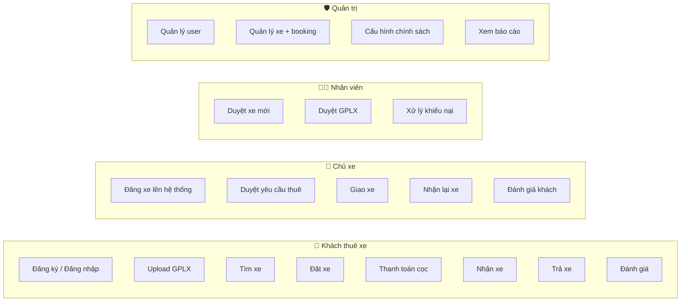

---

## 2. QUAN HỆ CÁC BẢNG — Nhìn tổng quan

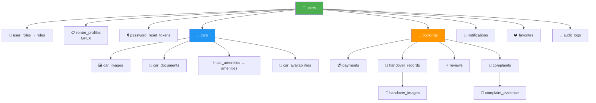

---

## 3. LUỒNG ĐĂNG KÝ & ĐĂNG NHẬP

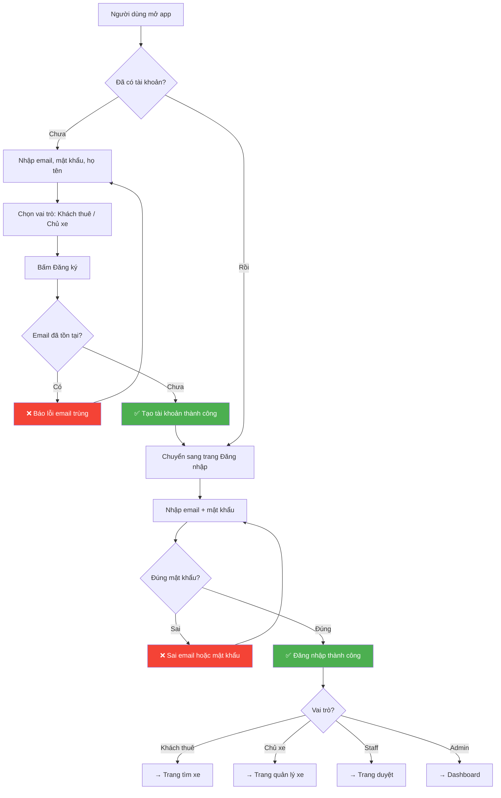

---

## 4. LUỒNG ĐĂNG XE — Owner

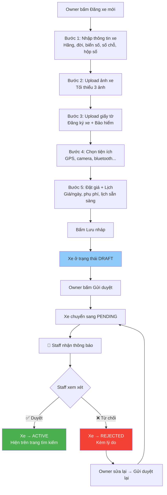

### Trạng thái xe — Chuyển đổi như thế nào?

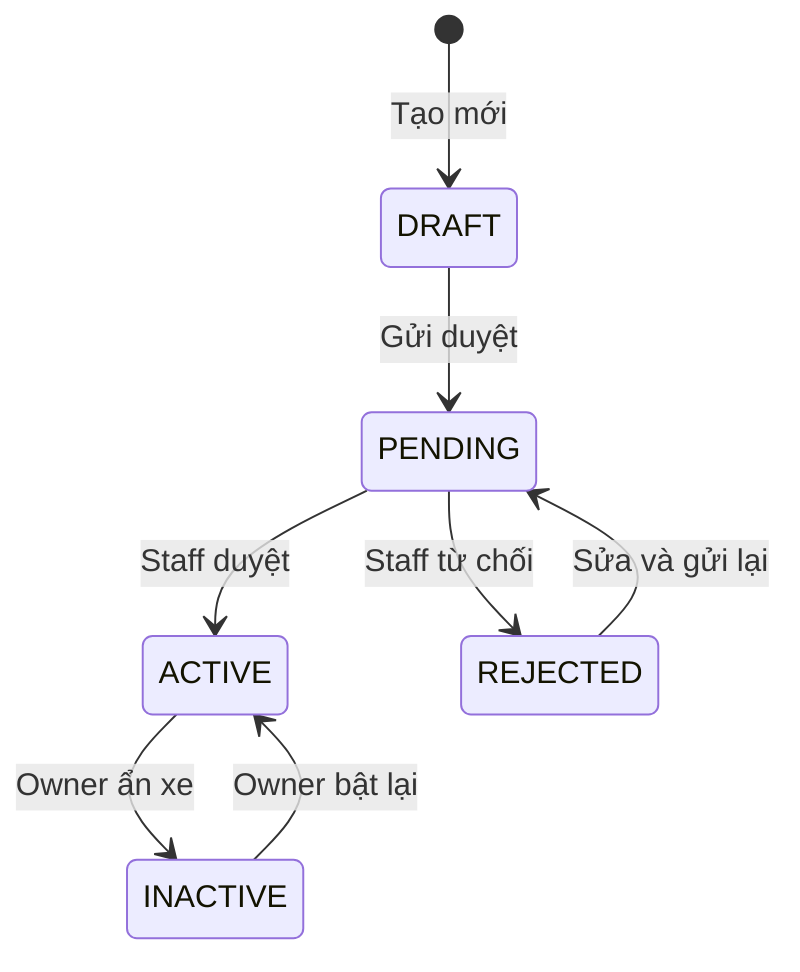

---

## 5. ⭐ LUỒNG ĐẶT XE — Luồng quan trọng nhất

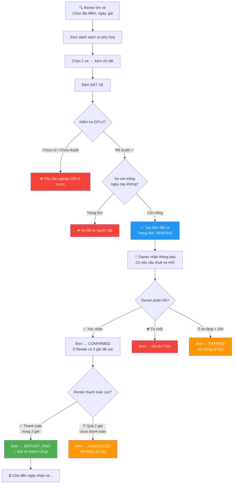

---

## 6. LUỒNG GIAO XE & TRẢ XE

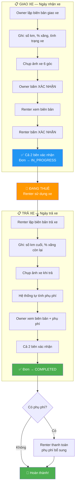

### Phụ phí tính thế nào?

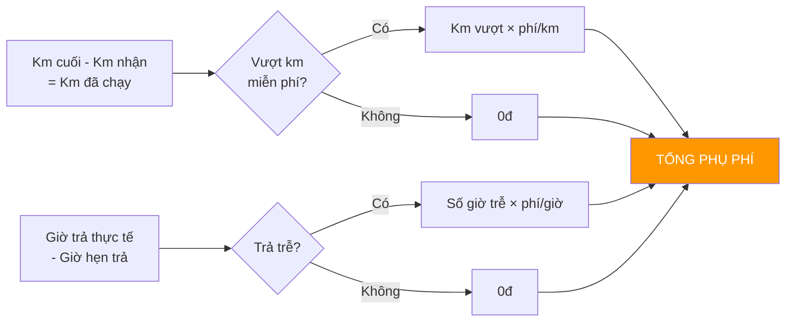

---

## 7. LUỒNG HỦY ĐƠN & HOÀN TIỀN

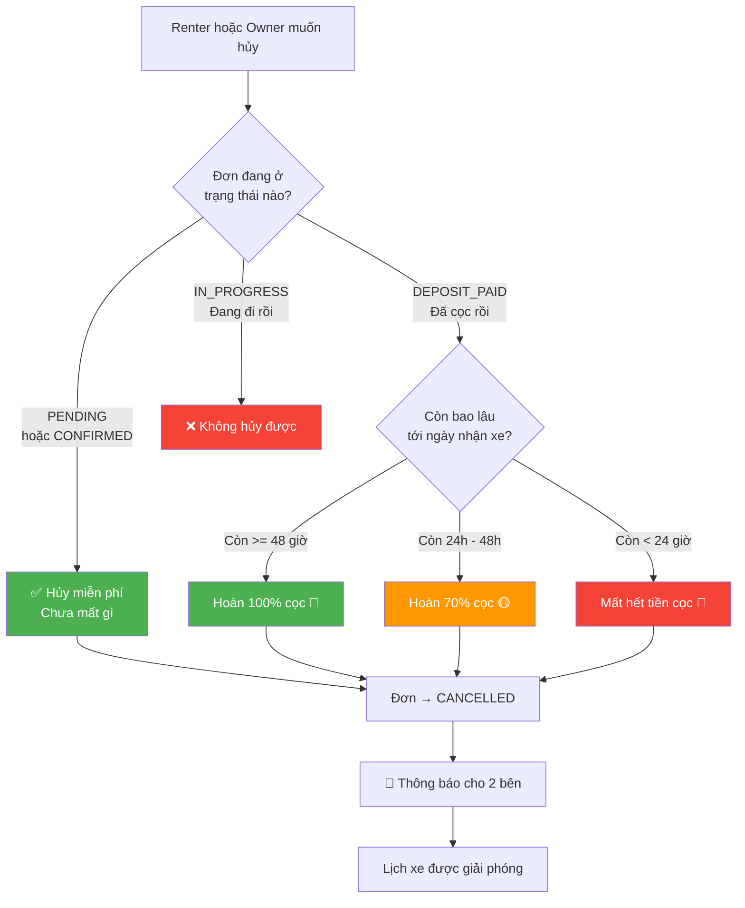

---

## 8. ⭐ VÒNG ĐỜI 1 BOOKING — Toàn cảnh

> Nhìn sơ đồ này là hiểu toàn bộ hệ thống

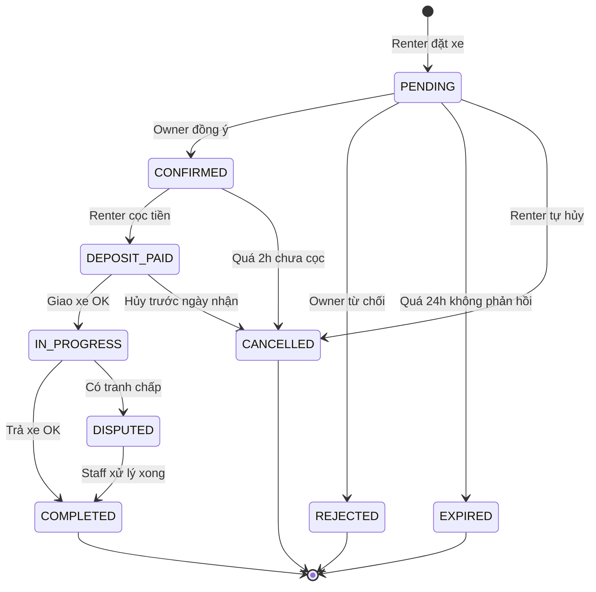

**Giải thích đơn giản:**

| Trạng thái | Nghĩa là gì? | Ai hành động tiếp? |
|---|---|---|
| **PENDING** | Renter vừa đặt, chờ Owner | Owner duyệt trong 24h |
| **CONFIRMED** | Owner đồng ý, chờ cọc | Renter thanh toán trong 2h |
| **DEPOSIT_PAID** | Đã cọc xong, chờ ngày nhận | Đến ngày → giao xe |
| **IN_PROGRESS** | Đang trong chuyến đi | Đến hạn → trả xe |
| **COMPLETED** | Xong xuôi | Cả 2 bên đánh giá |
| **REJECTED** | Owner từ chối | Renter đặt xe khác |
| **EXPIRED** | Owner im lặng quá 24h | Hệ thống tự hủy |
| **CANCELLED** | Đã hủy | Hoàn tiền theo chính sách |
| **DISPUTED** | Có tranh chấp | Staff xử lý |

---

## 9. LUỒNG ĐÁNH GIÁ & KHIẾU NẠI

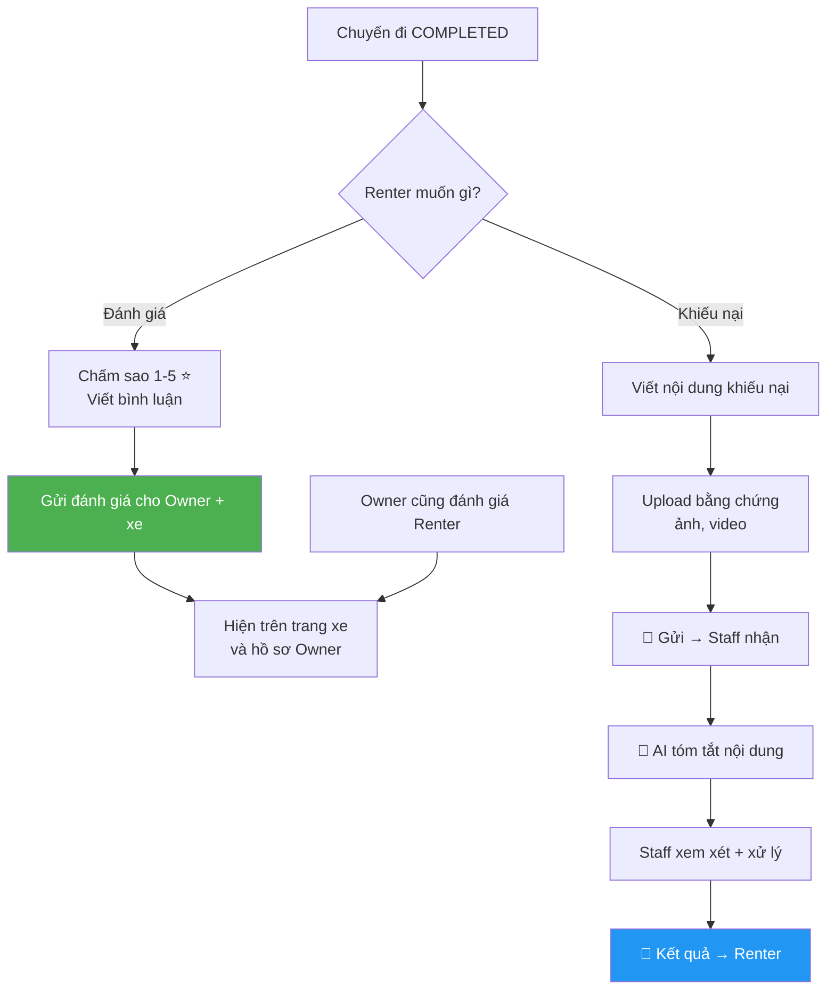

---

## 10. HỆ THỐNG TỰ ĐỘNG — Chạy ngầm

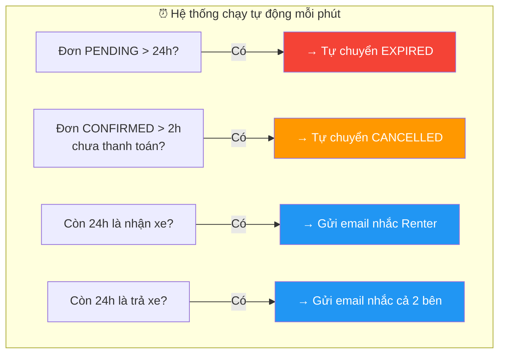

---

## 📌 TÓM TẮT — Luồng chính chỉ cần nhớ

```
Renter đặt xe → Owner duyệt → Renter cọc → Giao xe → Đi → Trả xe → Đánh giá
   PENDING    →  CONFIRMED  → DEPOSIT_PAID → IN_PROGRESS        → COMPLETED
```

Nếu bất kỳ bước nào timeout hoặc hủy → đơn chuyển sang **CANCELLED** / **EXPIRED** và hoàn tiền theo chính sách.
